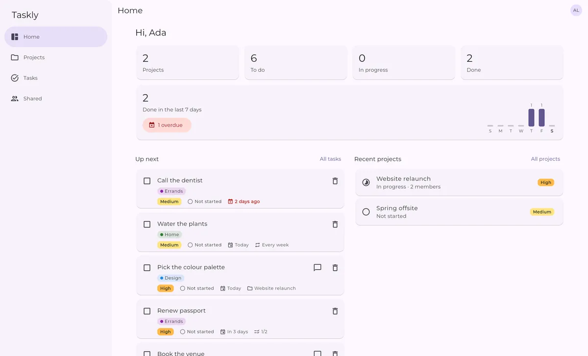
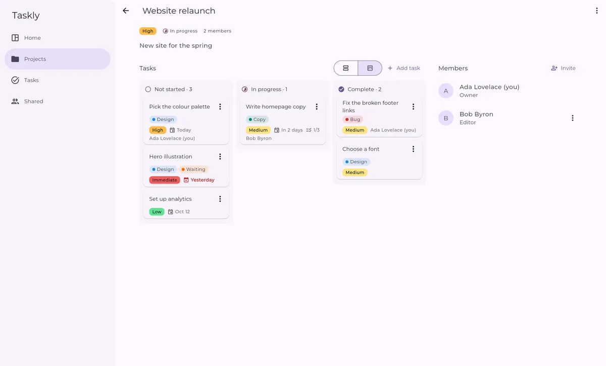
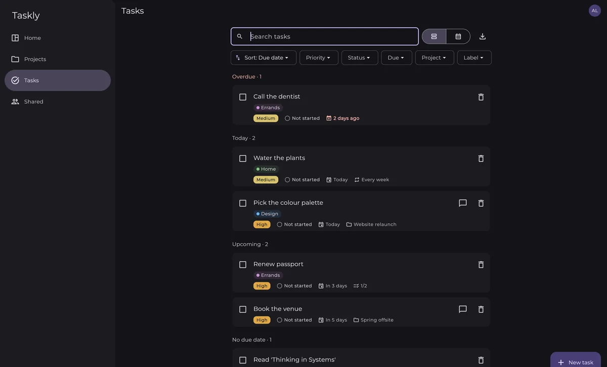
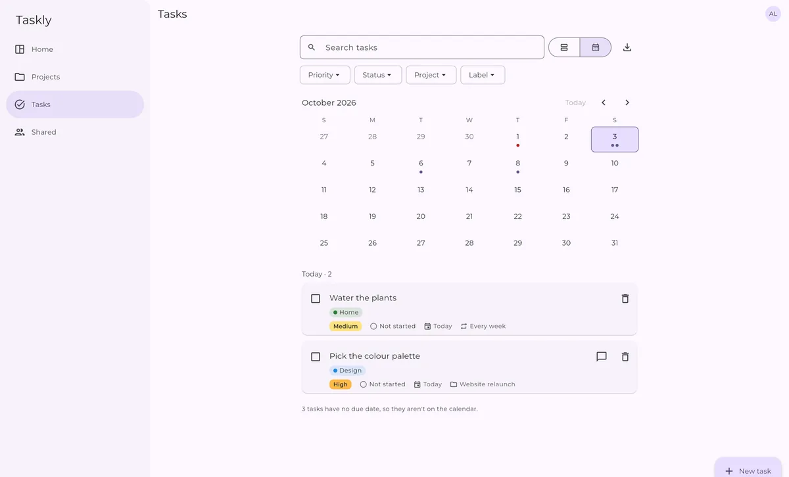
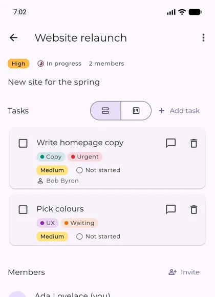

# Taskly

A task and project manager for small teams, built with Flutter and Firebase. Plan projects on a board, share them with the people you work with, and keep your own tasks next to theirs. It runs in the browser, installs as an app, works offline, and builds for Android.

**Try it:** [jaival.github.io/taskly-flutter](https://jaival.github.io/taskly-flutter/)



Taskly started as an internship project in 2021. Version 2 is a rewrite on current Flutter, Dart 3 and Firebase, one feature at a time. [ROADMAP.md](ROADMAP.md) tells that story, and [devops.md](devops.md) explains how it's built and why.

## Features

**Tasks**
- Personal tasks, and project tasks assigned to you, on one page. Grouped into Overdue, Today, Upcoming, No due date and Done.
- Due dates, priorities, statuses, checklists, and labels in nine colours.
- Tasks that repeat every day, week or month. Ticking one off adds the next.
- Search, filters (priority, status, due, project, label) and sorting. A month calendar of what's due.
- Export what's on the page as a spreadsheet (CSV) or a calendar file (iCal).

**Projects and teams**
- A list or a board for each project. Drag cards between columns, or use the card's menu.
- Invite people by email as editors or viewers. Viewers can tick off their own tasks, and nothing else.
- Comments on tasks, and a log of every change ("Alex moved this to In progress").

**Everywhere**
- Sign in with email and password, or with Google. Change your password or delete your account from your profile.
- Works offline: changes are kept on the device and sent when you're back online.
- Installs as an app from the browser, and offers new versions without interrupting you.
- Light and dark mode, keyboard shortcuts, screen-reader labels, and text that scales to 200%.

| Board | Tasks, in dark mode |
|---|---|
|  |  |

| Calendar | On a phone |
|---|---|
|  |  |

## Tech stack

| | |
|---|---|
| App | [Flutter](https://flutter.dev) 3.47 and Dart 3, Material 3 |
| State | [Riverpod](https://riverpod.dev) 3 |
| Routing | [go_router](https://pub.dev/packages/go_router), with real URLs and deep links |
| Backend | Firebase Authentication and Cloud Firestore, with [security rules](firestore.rules) as the access control |
| Offline and install | Firestore's on-device cache, and a [service worker](web/sw.js) of its own |
| Tests | Unit and widget tests, an integration test against the Firebase emulators, rules tests in Node |
| CI/CD | GitHub Actions: format, analyze, all the tests and a WebAssembly build on every PR; deploys to GitHub Pages from `main` |

The code is organised by feature (`lib/features/tasks`, `lib/features/projects`, …), each split into `domain`, `data` and `presentation`. [devops.md](devops.md) walks through it.

## Running it locally

You need the [Flutter SDK](https://docs.flutter.dev/get-started/install) (3.47), and for the local Firebase emulators, Node.js 22+ and Java 21+.

```bash
git clone https://github.com/Jaival/taskly-flutter.git
cd taskly-flutter
flutter pub get
```

**Against local emulators** (recommended: no Firebase account needed, nothing touches real data):

```bash
npm install -g firebase-tools
firebase emulators:start --only auth,firestore     # leave running; UI at http://localhost:4000
flutter run -d chrome --dart-define=USE_FIREBASE_EMULATORS=true
```

Sign up in the app to create a user in the emulator. Accounts and data are gone when the emulators stop.

**Against your own Firebase project:** create one with Email/Password sign-in and Firestore turned on, then point the app at it and publish the rules:

```bash
dart pub global activate flutterfire_cli
flutterfire configure            # rewrites lib/firebase_options.dart
firebase deploy --only firestore # rules and indexes
flutter run -d chrome
```

## Tests

```bash
flutter test                                   # unit and widget tests
cd rules_test && npm ci && npm test            # security rules, against the Firestore emulator
node --test "web_test/*.test.mjs"              # the service worker
flutter test integration_test -d <device> --dart-define=USE_FIREBASE_EMULATORS=true
                                               # the whole app; emulators running
```

[devops.md, section 6](devops.md#6-testing) covers what each suite proves, and how to run the integration test in Chrome.

## Project status

Everything in v1 has been rebuilt, plus the new features above. Still to come ([ROADMAP.md](ROADMAP.md)):
- Reminders and AI-assisted task entry. Both need Cloud Functions, which need Firebase's paid plan.
- An iOS build, which needs a Mac.
- Moving the hosting to Firebase Hosting, and monitoring.

The original 2021 code is tagged [`v1-internship`](https://github.com/Jaival/taskly-flutter/tree/v1-internship).
